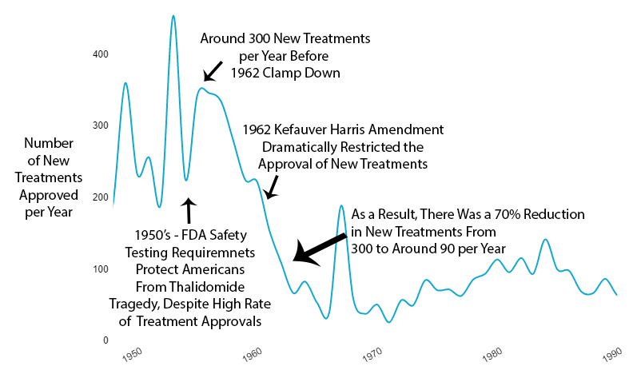

There is compelling historical evidence suggesting that large scale efficacy-trials based on real-world evidence have ultimately led to better health outcomes than current pharmaceutical industry-driven randomized controlled trials.

For over 99% of recorded human history, the average human life expectancy has been around 30 years.

**1893 - The Advent of Safety and Efficacy Trials**

In the late nineteenth and early twentieth century, clinical objectivity grew. The independent peer-reviewed Journal of the American Medical Association (JAMA) was founded in 1893. It would gather case reports from the 144,000 physicians members of the AMA on the safety and effectiveness of drugs. The leading experts in the area of a specific medicine would review all of the data and compile them into a study listing side effects and the conditions for which a drug was or was not effective. If a medicine were found to be safe, JAMA would give its seal of approval for the conditions where it was found to be effective.

The adoption of this system of crowd-sourced, observational, objective, and peer-reviewed clinical research was followed by a sudden shift in the growth of human life expectancy. After over 10,000 years of almost no improvement, we suddenly saw a strangely linear 4-year increase in life expectancy every single year.

**1938 - The FDA Requires Phase 1 Safety Trials**

A drug called Elixir sulfanilamide caused over [100 deaths](https://www.fda.gov/files/about%20fda/published/The-Sulfanilamide-Disaster.pdf) in the United States in 1937.

Congress [reacted](https://en.wikipedia.org/wiki/Elixir\_sulfanilamide) to the tragedy by requiring all new drugs to include:

> "adequate tests by all methods reasonably applicable to show whether or not such drug is safe for use under the conditions prescribed, recommended, or suggested in the proposed labeling thereof."

These requirements evolved to what is now called the [Phase 1 Safety Trial](https://en.wikipedia.org/wiki/Phase\_1\_safety\_trial).

This consistent four-year/year increase in life expectancy remained unchanged before and after the new safety regulations.

This suggests that the regulations did not have a large-scale positive or negative impact on the development of life-saving interventions.

#### **1950's - Thalidomide Causes Thousands of Birth Defects Outside US**

Thalidomide was first marketed in Europe in [1957](https://en.wikipedia.org/wiki/Thalidomide) for morning sickness. While it was initially thought to be safe in pregnancy, it resulted in thousands of horrific congenital disabilities.

Fortunately, the existing FDA safety regulations prevented any birth defects in the US. Despite the effectiveness of the existing US regulatory framework in protecting Americans, newspaper stories such as the one below created a strong public outcry for increased regulation.

#### **1962 - New Efficacy Regulations Reduce the Amount and Quality of Efficacy Data Collected**

As effective **safety** regulations were already in place, the government instead responded to the Thalidomide disaster by regulating **efficacy** testing via the 1962 Kefauver Harris Amendment. Before the 1962 regulations, it cost a drug manufacturer an average of \$74 million (2020 inflation-adjusted) to develop and test a new drug for safety before bringing it to market. Once the FDA had approved it as safe, efficacy testing was performed by the third-party American Medical Association. Following the regulation, trials were instead to be conducted in small, highly-controlled trials by the pharmaceutical industry.

**Reduction in Efficacy Data**

The 1962 regulations made these large real-world efficacy trials illegal. Ironically, even though the new regulations were primarily focused on ensuring that drugs were effective through controlled FDA efficacy trials, they massively reduced the quantity and quality of the efficacy data that was collected for several reasons:

* New Trials Were Much Smaller
* Participants Were Less Representative of Actual Patients
* They Were Run by Drug Companies with Conflicts of Interest Instead of the 3rd Party AMA

**Reduction in New Treatments**

The new regulatory clampdown on approvals immediately reduced the production of new treatments by 70%.

